### 启动项目
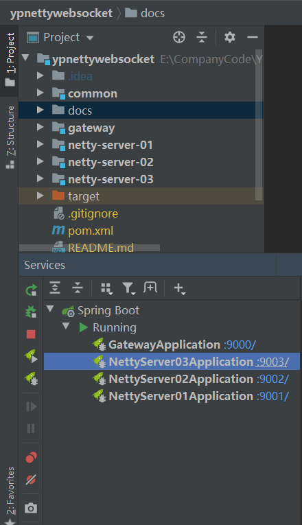
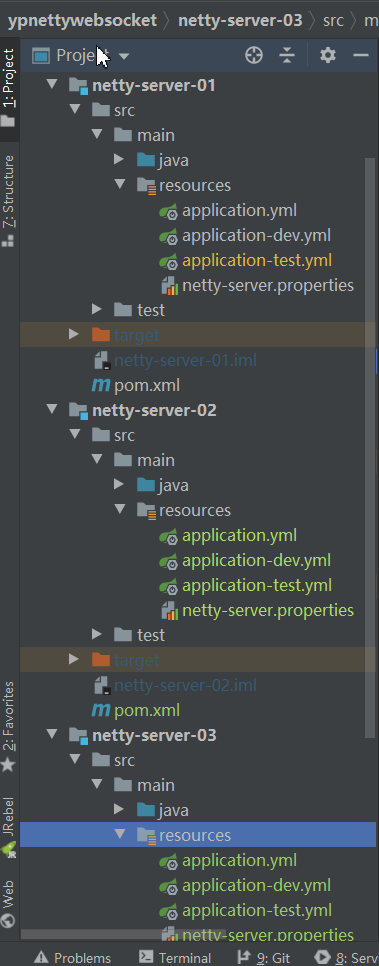
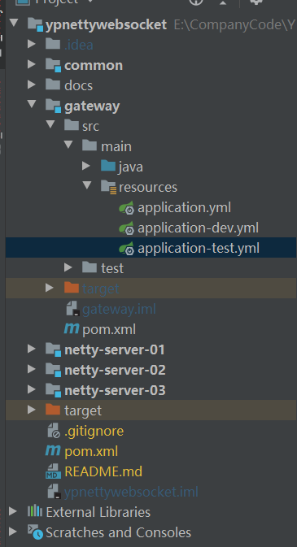

### Netty
请求的netty服务器地址，默认是我写的负载均衡算法。里面我写了其它的内置负载均衡算法(`com.lzhpo.common.loadbalance.MyZkLoadBalanceUtil`)。
客户端可以根据这个API地址请求Netty服务器地址，服务端轮询返回一个Netty服务端地址。
然后进行鉴权连接。
第一次请求：
第二次请求：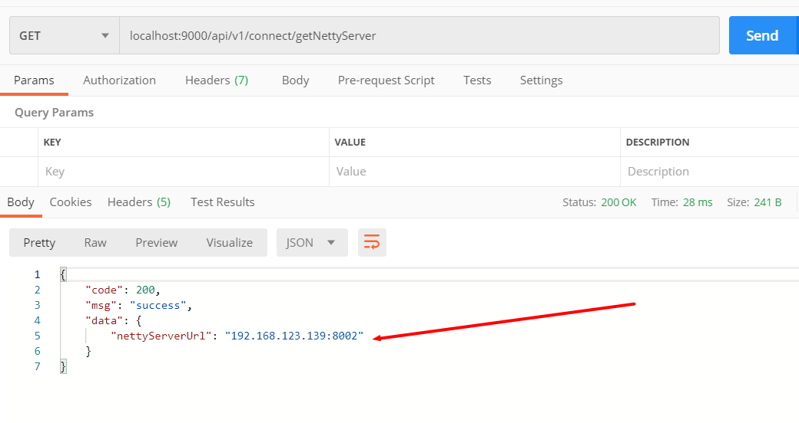
第三次请求：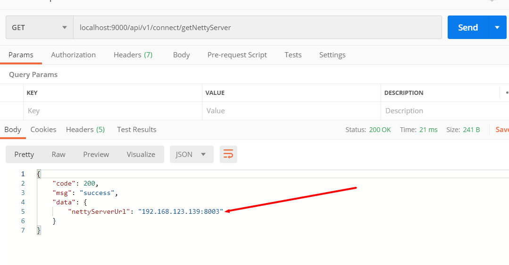

### 客户端如何鉴权？
客户端ID和Netty管道进行绑定，需要发送的内容：yp_sms_channel@#@1

可以使用在线工具：http://www.easyswoole.com/wstool.html

ws://localhost:8001/notice
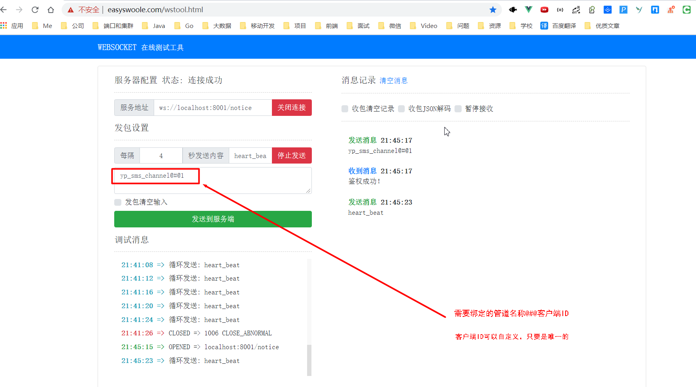

ws://localhost:8002/notice
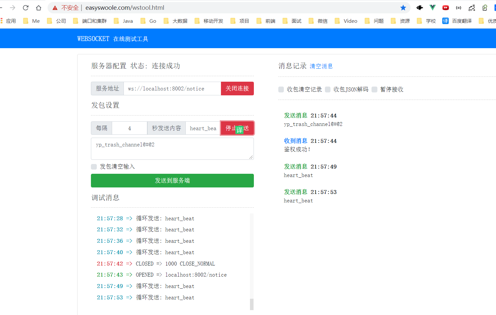

ws://localhost:8003/notice
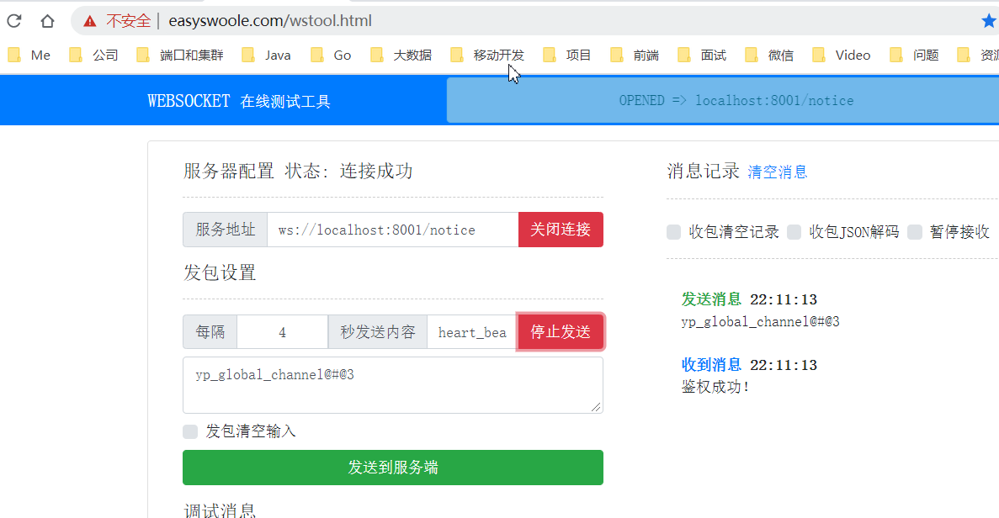

### 创建Zookeeper的Netty临时节点
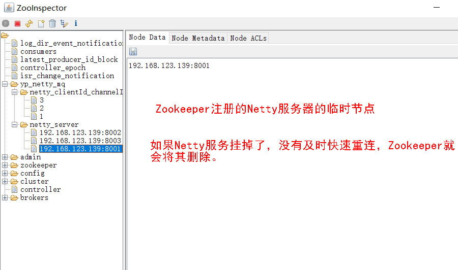

### 创建Zookeeper的客户端连接的临时节点
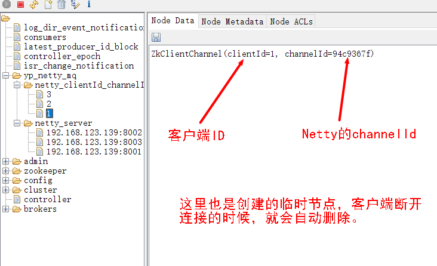

### 客户端连接信息在Redis存储的信息
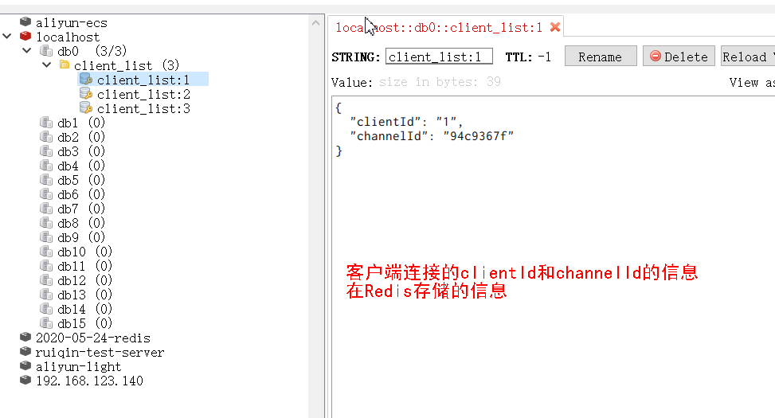

### 客户端如何发送心跳包
具体内容：heart_beat
见：`com.lzhpo.common.constant.MyConstant.HEART_BEAT`
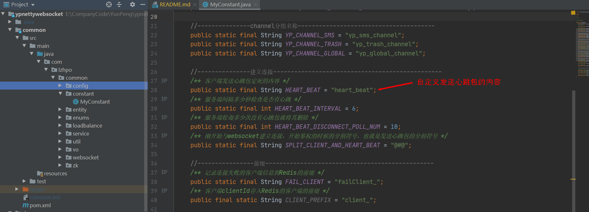

### 目前自定义的Kafka的topic
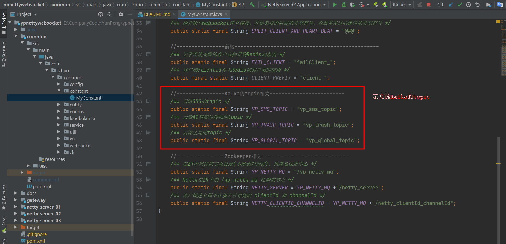
1. yp_sms_topic
2. yp_trash_topic
3. yp_global_topic

### 目前自定义的Netty的channel
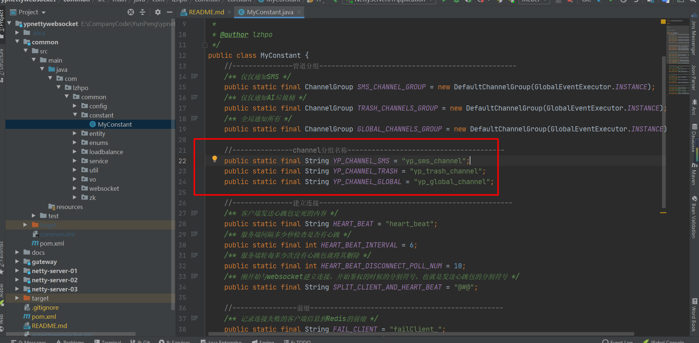
1. yp_sms_channel
2. yp_trash_channel
3. yp_global_channel

### 发送通知数据至Kafka
访问：http://localhost:9000/api/v1/kafka/pushMsgToMq
请求体：
```json
{
	"noticeLabel": "测试推送消息1",
	"publisher": "lzhpo",
	"receiverChannelIds": ["1", "2"],
	"channelGroup": "yp_sms_topic",
	"message": "我是测试推送消息内容1",
	"goToUrl": "https://www.lzhpo.com"
}
```
消息属性说明见`com.lzhpo.common.entity.NoticePackage`

### 发送心跳包以及服务剔除
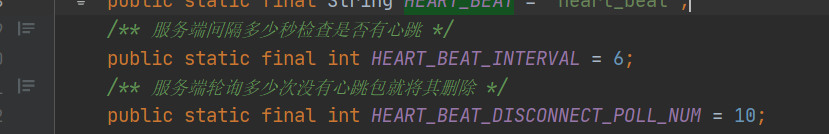

## 测试
发送消息至Kafka：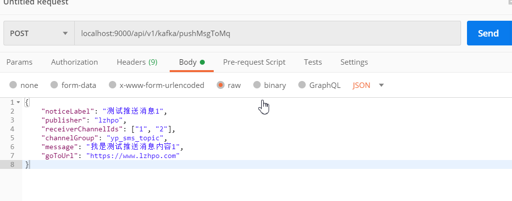

客户端收到消息：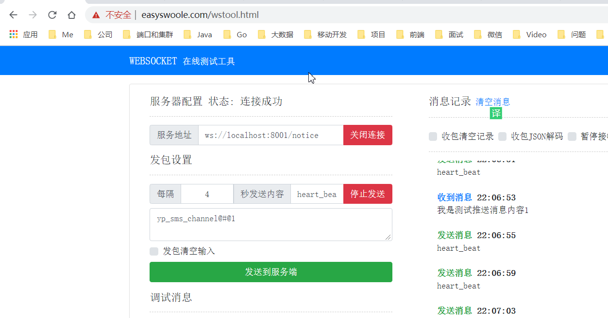

因为Id为1的客户端绑定了Netty的`yp_sms_topic`管道，其它客户端没有绑定`yp_sms_topic`管道，所以只有这个客户端收得到消息。


